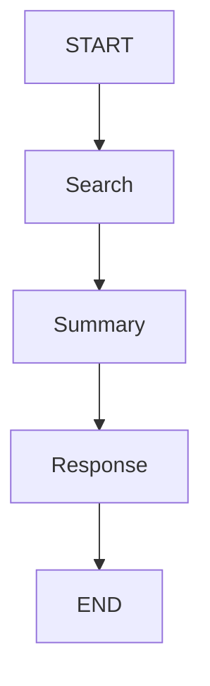
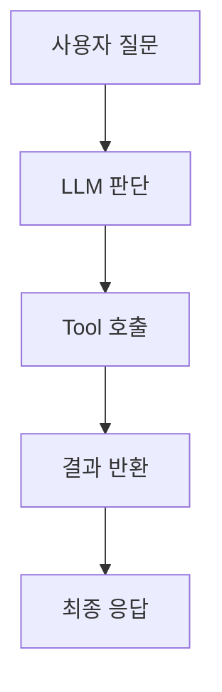
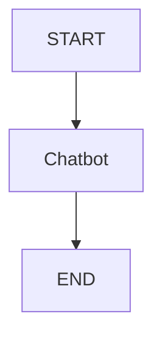

# 📚 LangGraph Agent 기초 정리

## 📅 2026-05-07

---

## 📌 오늘 목표

- LangGraph의 기본 구조 이해
- State / Node / Edge 개념 익히기
- Tool Calling과 Memory 동작 방식 이해
- 간단한 AI Agent 흐름 구성하기

---

# 🧠 핵심 개념 정리

---

## 1. State (상태 저장)

### 📌 개념

현재 대화나 데이터를 저장하는 공간.

```python
class State(TypedDict):
    messages: list
```

---

### 📌 왜 필요할까?

LLM이 이전 내용을 기억하려면 상태 저장이 필요함.

예시:

```text
사용자:
내 이름은 지혜야
```

State 저장 후:

```text
messages = [
  "내 이름은 지혜야"
]
```

---

### 📌 쉽게 이해하기

배달앱 상태 예시:

```text
- 메뉴 선택 완료
- 주소 입력 완료
- 결제 대기
```

현재 진행 상황을 저장하는 공간이 State이다.

---

## 2. Node (작업 수행)

### 📌 개념

실제 행동을 수행하는 함수.

```python
def chatbot(state):
    return {
        "messages": [
            llm.invoke(state["messages"])
        ]
    }
```

---

### 📌 역할

```text
현재 상태 확인
→ LLM 호출
→ 응답 생성
```

---

### 📌 쉽게 이해하기

회사 조직 예시:

| Node | 역할 |
|---|---|
| Search Node | 자료 검색 |
| Summary Node | 내용 요약 |
| Validation Node | 결과 검증 |
| Response Node | 최종 응답 |

즉:

```text
Node = 일을 수행하는 직원
```

---

## 3. Edge (흐름 연결)

### 📌 개념

Node와 Node를 연결하는 흐름.

```python
graph.add_edge("chatbot", END)
```

의미:

```text
chatbot 작업 후 종료
```

---

### 📌 흐름 예시



---

## 4. Tool Calling

### 📌 개념

LLM이 외부 기능을 사용하는 구조.

예시:

```python
@tool
def search_weather(city: str):
    return f"{city}는 맑음"
```

---

### 📌 왜 필요할까?

LLM은 기본적으로:

- 실시간 검색 불가
- 계산 약함
- DB 접근 불가

그래서 Tool을 연결해야 함.

---

### 📌 동작 흐름

```text
사용자:
서울 날씨 알려줘
```

Agent 내부:

```text
1. 날씨 정보 필요 판단
2. weather tool 호출
3. 결과 반환
4. 답변 생성
```

---

### 📌 Tool Calling Diagram



---

## 5. Memory (메모리)

### 📌 개념

이전 대화와 상태를 저장하는 기능.

---

### 📌 예시

사용자:

```text
내 이름은 지혜야
```

몇 분 후:

```text
내 이름 뭐야?
```

Memory 없을 경우:

```text
모름
```

Memory 있을 경우:

```text
지혜입니다
```

---

### 📌 Checkpointer

메모리 저장 기능.

```python
MemorySaver()
```

---

### 📌 thread_id

사용자별 대화 구분 ID.

```python
config = {
  "configurable": {
    "thread_id": "user1"
  }
}
```

---

# ⚙️ LangGraph 실행 흐름

---

## 기본 구조

```python
from langgraph.graph import StateGraph, START, END

graph = StateGraph(State)

graph.add_node("chatbot", chatbot)

graph.add_edge(START, "chatbot")
graph.add_edge("chatbot", END)

app = graph.compile()
```

---

## 실행 흐름



---

# 🧪 주요 코드

```python
# Graph 생성
graph = StateGraph(State)

# Node 추가
graph.add_node("chatbot", chatbot)

# 흐름 연결
graph.add_edge(START, "chatbot")
graph.add_edge("chatbot", END)

# 실행 가능한 형태로 변환
app = graph.compile()

# 실행
app.invoke(...)
```

---

# 🚀 실무 활용 예시

---

## Level 1 — 기본 챗봇

```text
질문 → 답변
```

---

## Level 2 — 검색 Agent

```text
질문
→ 웹 검색
→ 요약
→ 응답
```

---

## Level 3 — 업무 자동화

```text
메일 수집
→ 요약
→ 중요도 판단
→ 슬랙 전송
```

---

## Level 4 — Multi Agent

```text
기획 AI
개발 AI
검토 AI
```

여러 Agent 협업 가능.

---

# 📌 최종 핵심 요약

| 개념 | 의미 |
|---|---|
| State | 기억 |
| Node | 행동 |
| Edge | 흐름 |
| Tool | 외부 기능 |
| Memory | 상태 저장 |

---

# ✅ 한 줄 정리

> LangGraph는 상태(State)를 기반으로 여러 작업 흐름을 제어하는 AI Agent 프레임워크이다.
