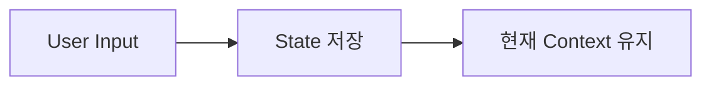
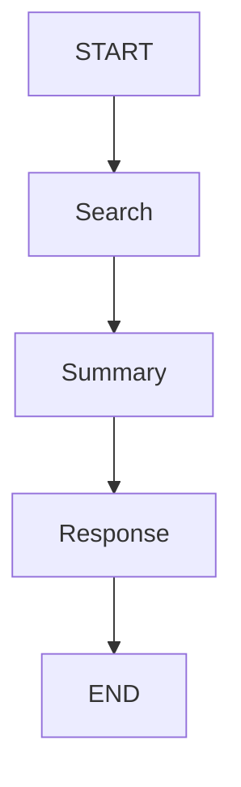
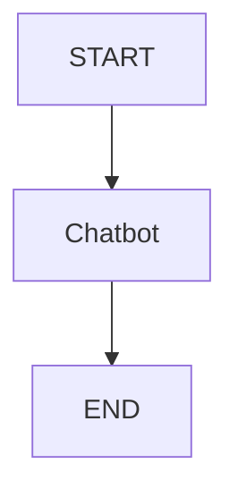
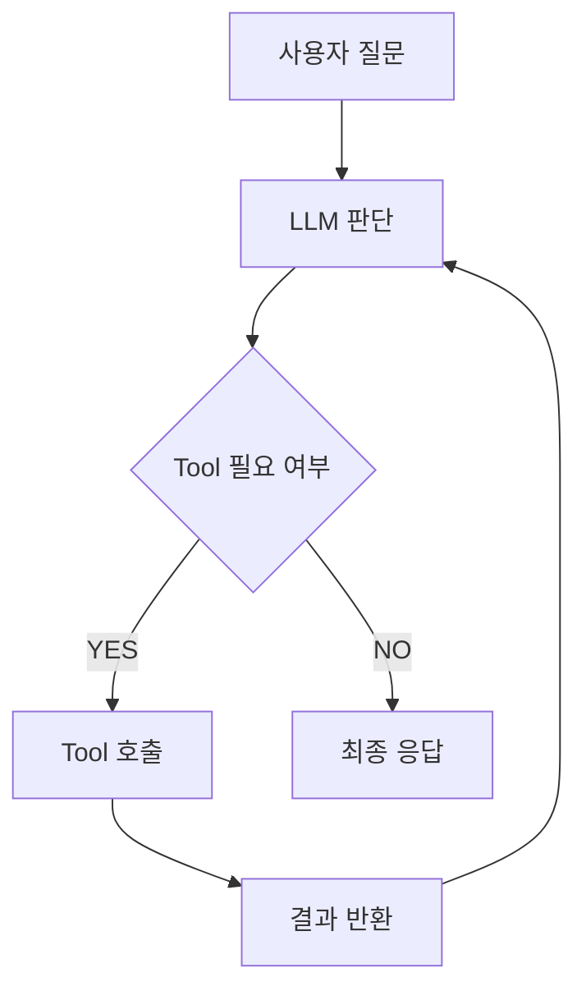
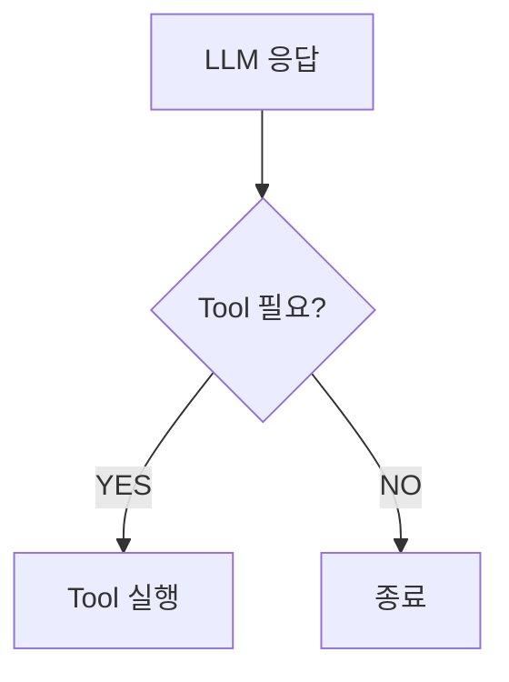
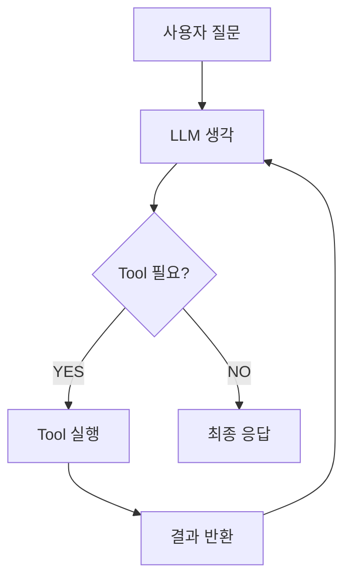
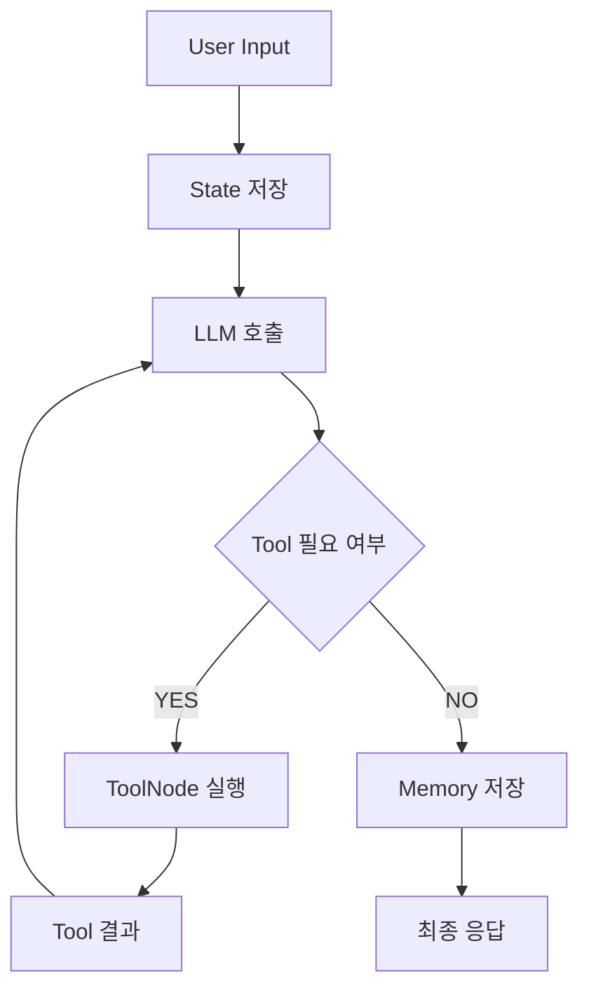

# 🤖 LangGraph Agent 기초 + Tool & Memory 정리

## 📅 2026-05-07

> LangGraph를 활용하여 상태(State)를 가진 AI Agent를 구성하고  
> Tool Calling과 Memory를 연결하는 전체 흐름 정리

---

# 📌 오늘 목표

- LangGraph 기본 구조 이해
- State / Node / Edge 개념 익히기
- Tool Calling 동작 방식 이해
- Memory 저장 구조 이해
- Agent Loop 흐름 이해
- 간단한 AI Agent 설계 흐름 파악

---

# 🧠 핵심 개념 정리

---

# 1. LangGraph란?

LangGraph는 LLM 기반 Agent의 실행 흐름을  
그래프(Graph) 형태로 관리하는 프레임워크이다.

기존 GPT 방식:

```text
질문 → 답변
```

LangGraph 방식:

```text
질문
 ↓
생각
 ↓
Tool 사용
 ↓
Memory 확인
 ↓
다음 행동 결정
 ↓
최종 응답
```

즉:

- 상태(State) 관리
- Tool 호출
- Memory 저장
- Workflow 제어

가 가능한 Agent 시스템을 만들 수 있다.

---

# 2. LangGraph 핵심 구성 요소

| 구성 요소 | 설명 |
|---|---|
| State | 현재 상태 저장 |
| Node | 작업 수행 |
| Edge | 흐름 연결 |
| Graph | 전체 프로세스 |
| Tool | 외부 기능 호출 |
| Memory | 대화 및 상태 저장 |

---

# 3. State (상태 저장)

## 📌 개념

현재 데이터나 대화 상태를 저장하는 공간.

---

## 📌 예시 코드

```python
from typing_extensions import TypedDict

class State(TypedDict):
    messages: list
```

---

## 📌 예시 데이터

```python
{
  "messages": [
    "안녕",
    "오늘 날씨 알려줘"
  ]
}
```

---

## 📌 쉽게 이해하기

배달앱 상태 예시:

```text
- 메뉴 선택 완료
- 주소 입력 완료
- 결제 대기
```

현재 진행 상태를 저장하는 공간이 State이다.

---

## 📌 State Diagram



---

# 4. Node (작업 수행)

## 📌 개념

실제 작업을 수행하는 함수.

---

## 📌 예시 코드

```python
def chatbot(state):
    return {
        "messages": [
            llm.invoke(state["messages"])
        ]
    }
```

---

## 📌 역할

```text
현재 상태 확인
→ LLM 호출
→ 응답 생성
```

---

## 📌 쉽게 이해하기

회사 조직 예시:

| Node | 역할 |
|---|---|
| Search Node | 자료 검색 |
| Summary Node | 내용 요약 |
| Validation Node | 결과 검증 |
| Response Node | 최종 응답 |

즉:

```text
Node = 일을 수행하는 직원
```

---

# 5. Edge (흐름 연결)

## 📌 개념

Node와 Node를 연결하는 흐름.

---

## 📌 예시 코드

```python
graph.add_edge("chatbot", END)
```

의미:

```text
chatbot 실행 후 종료
```

---

## 📌 흐름 예시



---

# 6. Graph 생성

## 📌 기본 구조

```python
from langgraph.graph import StateGraph, START, END

graph = StateGraph(State)

graph.add_node("chatbot", chatbot)

graph.add_edge(START, "chatbot")
graph.add_edge("chatbot", END)

app = graph.compile()
```

---

## 📌 실행 흐름



---

## 📌 compile()

```python
graph.compile()
```

의미:

```text
실행 가능한 앱 형태로 변환
```

---

## 📌 invoke()

```python
app.invoke(...)
```

의미:

```text
실제 Agent 실행
```

---

# 7. Tool Calling

## 📌 Tool이 필요한 이유

LLM은 기본적으로:

- 실시간 검색 불가
- 계산 약함
- DB 접근 불가

그래서 외부 기능(Tool)을 연결해야 한다.

---

## 📌 Tool 예시

```python
from langchain.tools import tool

@tool
def search_weather(city: str):
    return f"{city}는 맑음"
```

---

# 8. bind_tools()

## 📌 개념

LLM에게 사용할 수 있는 Tool 목록을 연결.

---

## 📌 예시 코드

```python
llm_with_tools = llm.bind_tools(tools)
```

---

## 📌 의미

```text
"필요하면 Tool 사용 가능"
```

이라고 LLM에게 알려주는 과정.

---

# 9. ToolNode

## 📌 개념

Tool 실행을 담당하는 Node.

---

## 📌 예시 코드

```python
tool_node = ToolNode(tools)
```

---

## 📌 역할

```text
Tool 실행 전담
```

---

# 10. Tool Calling 흐름

## 📌 예시 상황

사용자:

```text
서울 날씨 알려줘
```

Agent 내부:

```text
1. 날씨 정보 필요 판단
2. weather tool 호출
3. 결과 반환
4. 최종 응답 생성
```

---

## 📌 Tool Calling Diagram



---

# 11. tools_condition

## 📌 개념

Tool 호출 여부를 판단하는 조건 함수.

---

## 📌 역할

```text
Tool 사용 필요 여부 판단
```

---

## 📌 흐름 예시

```python
graph.add_conditional_edges(
    "chatbot",
    tools_condition
)
```

---

## 📌 동작 구조



---

# 12. MessageState

## 📌 개념

대화 메시지를 자동 관리하는 State 구조.

---

## 📌 관리 대상

- HumanMessage
- AIMessage
- ToolMessage

---

## 📌 예시

```python
from langgraph.graph.message import MessagesState
```

---

## 📌 메시지 흐름 예시

```text
HumanMessage:
서울 날씨 알려줘

AIMessage:
Tool 호출 필요

ToolMessage:
서울은 맑음

AIMessage:
서울은 현재 맑습니다
```

---

# 13. Memory (메모리)

## 📌 개념

이전 대화와 상태를 저장하는 기능.

---

## 📌 Memory가 없는 경우

```text
질문 → 답변 → 종료
```

---

## 📌 Memory가 있는 경우

```text
이전 대화 기억
사용자 정보 유지
중간 결과 저장
```

---

## 📌 예시

사용자:

```text
내 이름은 지혜야
```

몇 분 후:

```text
내 이름 뭐야?
```

Memory 없을 경우:

```text
모름
```

Memory 있을 경우:

```text
지혜입니다
```

---

# 14. Checkpointer

## 📌 개념

대화 상태를 저장하는 기능.

---

## 📌 예시 코드

```python
MemorySaver()
```

---

## 📌 역할

```text
현재 대화 상태 저장
```

---

# 15. thread_id

## 📌 개념

사용자별 대화를 구분하는 ID.

---

## 📌 예시 코드

```python
config = {
  "configurable": {
    "thread_id": "user1"
  }
}
```

---

## 📌 역할

```text
사용자별 Memory 분리
```

---

# 16. Agent Loop 구조

## 📌 핵심 개념

LangGraph Agent는 한 번 실행 후 끝나지 않는다.

```text
생각
→ Tool 사용
→ 결과 확인
→ 다시 판단
→ 추가 Tool 사용 가능
→ 최종 응답
```

이 반복 구조를 가진다.

---

## 📌 Agent Loop Diagram



---

# ⚙️ 전체 실행 흐름



---

# 🧪 주요 코드 정리

## Graph 생성

```python
graph = StateGraph(MessagesState)
```

---

## Tool 연결

```python
llm_with_tools = llm.bind_tools(tools)
```

---

## ToolNode 생성

```python
tool_node = ToolNode(tools)
```

---

## Conditional Edge

```python
graph.add_conditional_edges(
    "chatbot",
    tools_condition
)
```

---

## Memory 연결

```python
memory = MemorySaver()
```

---

## 실행

```python
app.invoke(...)
```

---

# 🚀 실무 활용 예시

---

## Level 1 — 기본 챗봇

```text
질문 → 답변
```

---

## Level 2 — 검색 Agent

```text
질문
→ 웹 검색
→ 요약
→ 응답
```

---

## Level 3 — 업무 자동화

```text
메일 수집
→ 요약
→ 중요도 판단
→ 슬랙 전송
```

---

## Level 4 — Multi Agent

```text
기획 AI
개발 AI
검토 AI
```

여러 Agent 협업 가능.

---

# 📌 최종 핵심 요약

| 개념 | 의미 |
|---|---|
| State | 기억 |
| Node | 행동 |
| Edge | 흐름 |
| Tool | 외부 기능 |
| Memory | 상태 저장 |
| ToolNode | Tool 실행 담당 |
| Agent Loop | 반복적 판단 구조 |

---

# ✅ 한 줄 정리

> LangGraph는 상태(State), Tool, Memory를 기반으로 작업 흐름을 제어하는 AI Agent 프레임워크이다.

---

# 🔗 참고

- LangGraph Docs  
  https://docs.langchain.com/oss/python/langgraph/overview

- LangChain Docs  
  https://python.langchain.com/

- Mermaid Docs  
  https://mermaid.js.org/
